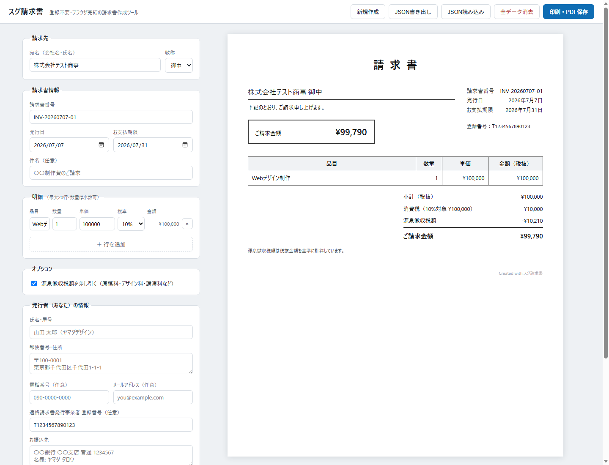

# スグ請求書

**登録不要・ブラウザ完結・無料で使える、インボイス制度対応の請求書作成ツール**

会員登録なしで、開いた瞬間に請求書が作れます。入力データはブラウザ（localStorage）にのみ保存され、
**サーバーには一切送信されません**。



## 主な機能

- 請求書の作成・リアルタイムプレビュー・**印刷 / PDF保存**（A4縦）
- **インボイス制度（適格請求書）対応**
  - 登録番号（T+13桁）の記載・形式チェック
  - 税率ごと（10% / 軽減8%）の区分記載と「※」注記
  - 消費税の端数処理は「税率ごとに合算後、1回だけ切り捨て」（制度ルール準拠）
- **源泉徴収税額の自動計算**（100万円以下 10.21% / 超過分 20.42% の2段階）
- 入力内容の自動保存（localStorage）・復元
- JSONエクスポート / インポート（バックアップ・使い回し）
- 依存パッケージ **ゼロ**（Vanilla JS・ビルド不要・外部CDNなし）

## セットアップ

必要なもの: [Node.js](https://nodejs.org/) 18以上（開発サーバーとテスト実行のみに使用。アプリ本体は静的ファイル）

```bash
git clone https://github.com/samekoro/sugu-invoice.git
cd sugu-invoice
npm run dev        # → http://localhost:5173（npm install 不要）
```

## 使い方

1. ブラウザで http://localhost:5173 を開く
2. 左側のフォームに「請求先」「明細」「発行者情報」を入力する（右側に即時プレビュー）
3. 必要に応じて「源泉徴収税額を差し引く」にチェック
4. **「印刷・PDF保存」** → ブラウザの印刷ダイアログで「PDFに保存」を選ぶ

| ボタン | 動作 |
|---|---|
| 新規作成 | 発行者情報を残して、請求先・明細・備考をクリア |
| JSON書き出し / 読み込み | 請求書データのバックアップと復元 |
| 全データ消去 | localStorageを含む全データの削除（共有PC向け） |

## テスト

```bash
npm test           # 計算ロジック（消費税・源泉徴収・端数処理）のユニットテスト
npm run check      # JSの構文チェック
```

## デプロイ

配信対象は `src/` ディレクトリのみ（ビルド不要）。任意の静的ホスティングにそのまま配置できます。

## ディレクトリ構成

```
├── src/                     # 配信対象（このディレクトリをそのままデプロイ）
│   ├── index.html
│   ├── css/style.css        # 画面CSS + 印刷CSS
│   └── js/
│       ├── calc.js          # 金額計算（純粋関数・テスト対象）
│       └── app.js           # UI制御・localStorage・印刷
├── scripts/dev-server.mjs   # 開発用静的サーバー（Node標準のみ）
└── tests/calc.test.mjs      # ユニットテスト（node --test）
```

## 免責事項

本ツールの計算結果は参考情報であり、税務上の助言ではありません。
金額・税額の最終確認は利用者ご自身または税理士にご確認ください。

## ライセンス

All Rights Reserved。詳細は [LICENSE](LICENSE) を参照してください。
